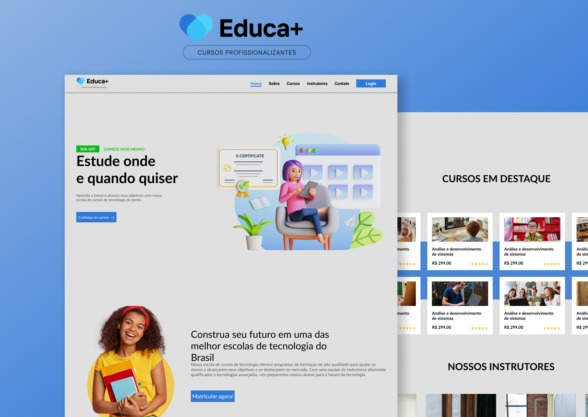

<h1 align="center">Projeto Educa+ | React JS</h1>

<h2 align="center">Sobre</h2>

O layout desse projeto foi disponibilizado por: <a href="https://www.instagram.com/futurodevjohn?utm_source=ig_web_button_share_sheet&igsh=ZDNlZDc0MzIxNw==">Futuro Dev - John.</a> E com base nesse layout eu consegui aplicar alguns dos conhecimentos obtido durante o meu curso de ReactJS.</a> 

  <a href="#-tecnologias">Tecnologias</a>&nbsp;&nbsp;&nbsp;|&nbsp;&nbsp;&nbsp;
  <a href="#-projeto">Projeto</a>&nbsp;&nbsp;&nbsp;|&nbsp;&nbsp;&nbsp;
  <a href="#-layout">Layout</a>&nbsp;&nbsp;&nbsp;|&nbsp;&nbsp;&nbsp;
  <a href="#memo-licença">Licença</a>

  

 

  

## 🚀 Tecnologias

Esse projeto foi desenvolvido com as seguintes tecnologias:

- React JS
- React Router Dom
- React Icons
- Figma

## 💻 Projeto

- [Visite o projeto online](https://kelvinymickael.github.io/EDUCA-PLUS/)

## 🔖 Layout

Você pode visualizar o layout do projeto através [DESSE LINK](https://www.figma.com/file/uNOG7BGVyCZPSt43HBvHAr/Projeto-Educa%2B?type=design&node-id=1-2&mode=design&t=VNlqAXASAjFeBO0Y-0). É necessário ter conta no [Figma](https://figma.com) para acessá-lo.

## :memo: Licença

Esse projeto está sob a licença MIT.

---

Developed By Kelviny Mickael.
